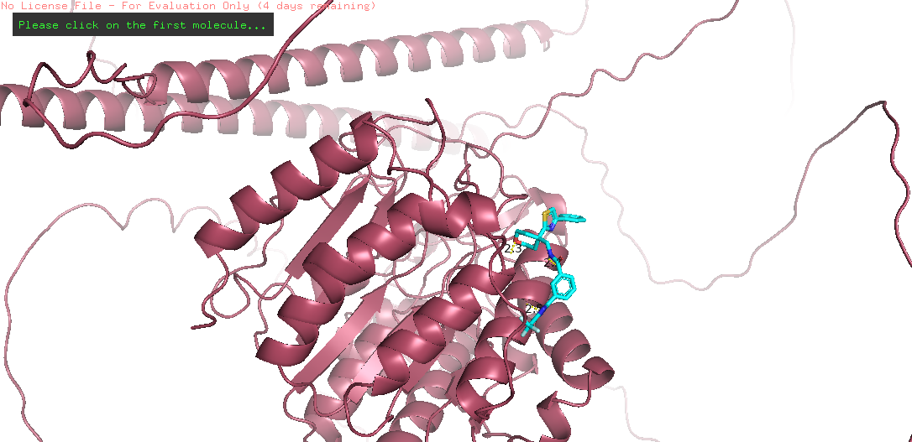

### **Stage 4 Report** 

### **Authors:** Mohamed (@M0hamed), Jana (@JanaMoussa.0), Youssif (@youssif74), Habiba (@pop-12).

### **(Phase 1\)**

The application of machine learning (ML) in cancer drug discovery has gained momentum due to its potential to improve personalised medicine. Traditional drug response prediction methods rely on high-throughput screening, which can be limited by incomplete data and high costs.

Recent advancements have integrated ML techniques to predict cancer cell sensitivity to drugs by using genomic features of cancer cells and chemical properties of drugs. The study by Menden et al. (2013) developed ML models using data from the Genomics of Drug Sensitivity in Cancer (GDSC) project, incorporating 138 genomic features and 689 chemical descriptors. These models achieved an R² of 0.72 during cross-validation and 0.64 in independent tests.

The study’s key finding was that combining genomic and chemical data improves prediction accuracy, enabling the imputation of missing drug response values and identifying opportunities for drug repositioning. This approach enhances drug screening efficiency and supports the development of personalised treatment strategies by linking patient-specific genomic traits with drug sensitivity.

**Methodology  (used for preparing dataset, training model and hyperparameter optimization)**

**Dataset Preparation**:

* Install necessary libraries for cheminformatics and data processing.  
* Import the dataset containing dose-response data and filter it to select the most frequent cell line.  
* Retrieve SMILES representations for the selected drugs using pubchempy, with error handling for potential issues.  
* Concatenate the SMILES data with the cell line information to create a comprehensive dataset (df_final).

**Descriptor Calculation**:

* Calculate Lipinski's Rule of Five descriptors (Molecular Weight, LogP, Hydrogen Donors, and Acceptors) for each compound.  
* Compute over 200 additional molecular descriptors using the RDKit library to enrich the dataset with chemical information.  
* Integrate these descriptors into the df_final dataframe.

**Feature Engineering**:

* Clean the dataset by removing invalid SMILES representations.  
* Export the relevant features (SMILES and drug names) for external use.

**Model Training and Hyperparameter Optimization**:

* Set up the pycaret library for regression tasks, preprocessing the data and specifying the target variable (LN_IC50).  
* Compare multiple regression models to identify the best performer.  
* Tune the hyperparameters of the best model to enhance performance and evaluate the model using visual metrics.

**Prediction and Analysis**:

* Prepare a dataset for predictions by excluding the target variable.  
* Use the tuned model to predict LN_IC50 values and compare actual versus predicted results with scatter plots for performance analysis.

**Results and interpretation of your model**

The LightGBM model was selected based on its lower Mean Absolute Error (MAE) of 2.2064 and Root Mean Squared Error (RMSE) of 2.6909 compared to other models. A scatter plot demonstrated a linear correlation between actual and predicted values, indicating effective model performance.

**Comparison with the findings of the target paper.**

| Aspect | Paper Methodology | Our Methodology |
| ----- | ----- | ----- |
| **Data Source** | **GDSC project with extensive cancer cell line data** | **ChemBL database focused on HDAC2** |
| **Feature Types** | **Combines genomic features with chemical descriptors** | **Primarily uses chemical descriptors from Lipinski** |
| **Modeling Techniques** | **Neural networks and random forests** | **Multiple regression models including Random Forest** |
| **Cross-Validation** | **8-fold cross-validation with blind testing** | **K-Fold cross-validation (5 splits)** |
| **Performance Metrics** | **Pearson correlation, R², RMSE** | **Mean RMSE, Mean R², Mean MAE** |

| Metric | Our Results | Paper Results |
| ----- | ----- | ----- |
| **Mean Absolute Error** | **2.2064** | **Not found** |
| **Root Mean Squared Error** | **2.6909** | **RMSE \= 0.83 (cross-validation)** |
|  |  | **RMSE \= 0.97 (blind test)** |
| **Correlation Coefficient** | **none** | **Rp \= 0.85 (cross-validation)** |
|  |  | **Rp \= 0.79 (blind test)** |
| **Coefficient of Determination** | **none** | **R² \= 0.72 (cross-validation)** |
|  |  | **R² \= 0.64 (blind test)** |

**Conclusion** 

In summary, this project demonstrates the significant potential of machine learning to enhance predictions of cancer drug responses by integrating genomic and chemical data. While the LightGBM model showed promising performance, the variability in accuracy among different models highlights the need for further refinement and optimization. 

### **(Phase 2\)**

Histone deacetylases (HDACs) are enzymes that regulate gene expression by removing acetyl groups from histones and other proteins, altering chromatin structure and affecting transcriptional activity. In humans, HDACs are divided into four classes based on structure and function, with 11 major subtypes:

* **Class I (HDAC1, 2, 3, 8):** Primarily nuclear, involved in cell proliferation and apoptosis.  
* **Class II (HDAC4, 5, 6, 7, 9, 10):** Shuttles between the nucleus and cytoplasm, mediating tissue-specific functions.  
* **Class IV:** Comprises only HDAC11, which has distinct biological roles.

HDACs are promising targets for cancer therapy due to their role in tumorigenesis. By removing acetyl groups, HDACs compact chromatin, repressing tumour suppressor genes and promoting oncogene activity, often observed in aggressive cancers with poor prognosis. HDAC inhibitors (HDACis) have demonstrated significant anticancer effects, including cell cycle arrest, differentiation, apoptosis, and reduced angiogenesis.

**Methodology**

* **Phytochemical Library Preparation**:  
  * 65 phytochemicals were extracted from the review "Green Tea: A Review of Its Phytochemistry, Pharmacology, and Toxicology."  
  * 12 validated inhibitors were compiled for each HDAC subtype from the literature.  
* **Ligand & Protein Preparation**:  
  * **Ligands**: 68 ligands were collected from PubChem and merged using OpenBabel.  
  * **Proteins**: Structures for 11 HDAC subtypes were obtained from the Protein Data Bank (PDB); some were modelled with AlphaFold.  
  * **Active Site Identification**: Fpocket was used to identify active sites.  
* **Molecular Docking**:  
  * Ligands were converted into PDBQT format.  
  * Docking simulations with PyRx assessed binding affinities.  
  * Results were averaged from triplicate docking runs, and mean and standard deviations were calculated.

**Key Findings: Docking Analysis of HDAC Subtypes**

* **HDAC1**:  
  * **Best Ligand**: Epicatechin  
  * **Potential**: Inhibits HDAC1, reactivating tumor suppressor genes in cancers like breast, colon, and prostate.  
* **HDAC2 & HDAC3**:  
  * **Best Ligand**: Tubastatin A  
  * **Potential**: Inhibits HDAC2 and HDAC3, promoting apoptosis and targeting lung, colorectal, and leukemia cancers.  
* **HDAC4, 5, 6, 7, 8, 9**:  
  * **Best Ligand**: TMP269  
  * **Potential**: Targets several cancers (osteosarcoma, breast, colon, lymphoma, neuroblastoma), disrupting cell survival and metastasis pathways.  
* **HDAC10**:  
  * **Best Ligand**: TMP269  
  * **Potential**: Could overcome chemotherapy resistance in ovarian cancer.  
* **HDAC11**:  
  * **Best Ligand**: Pelargonidin  
  * **Potential**: Enhances immune response in cancer, improving immunotherapy in cancers like melanoma and lung cancer.

**Comparison with Target Paper**:

* **HDAC1**:  
  * **Our Findings**: Epicatechin had a binding affinity of \-9.3.  
  * **Paper**: Compound 5A scored \-5.2, and FT895 scored \-8.4.  
* **HDAC6**:  
  * **Our Findings**: TMP269 scored \-9.  
  * **Paper**: Compound 5A scored \-5.8, and FT895 scored \-7.8.  
* **HDAC8**:  
  * **Our Findings**: TMP269 scored \-8.1.  
  * **Paper**: Compound 5A scored \-5.3, and FT895 scored \-7.3.  
* **HDAC11**:  
  * **Our Findings**: Pelargonidin scored \-9.  
  * **Paper**: Compound 5A scored \-5.6, and FT895 scored \-7.7.  
      
    

**Visualisations**

Figure 1: visualisation of HDAC1 with the ligand epicatechin 

Figure 2: visualisation of HDAC2 with the ligand Tubastatin A

Figure 3: visualisation of HDAC3 with the ligand Tubastatin A 

Figure 4: visualisation of HDAC4  with the ligand TMP269 

Figure 5: visualisation of HDAC5 with the ligand TMP269 

Figure 6: visualisation of HDAC6  with the ligand TMP269 

Figure 7: visualisation of HDAC7 with the ligand TMP269 

Figure 8: visualisation of HDAC8  with the ligand TMP269 

Figure 9: visualisation of HDAC9  with the ligand TMP269 

Figure 10 : visualisation of HDAC10  with the ligand TMP269 

Figure 11: visualisation of HDAC11 with the ligand Pelargonidin 

Figure 12: a heatmap from the mean of the docking scores of the 11 HDAC subtypes

**Conclusion** 

Natural compounds like epicatechin (flavonoid) and pelargonidin (anthocyanin) show higher binding affinities than synthetic inhibitors, indicating strong potential as HDAC inhibitors. These compounds could not only inhibit cancer progression but also provide additional antioxidant and anti-inflammatory benefits, making them attractive candidates for future cancer therapies.

